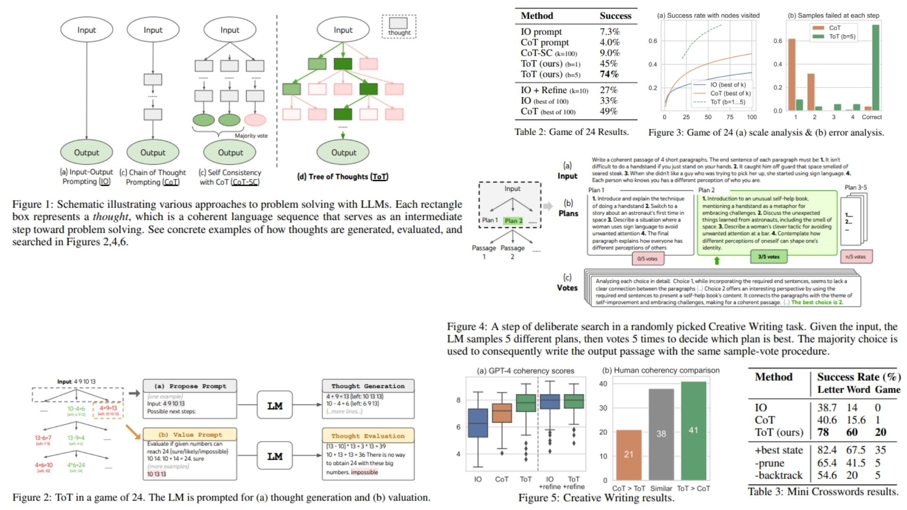

# 🌳 Tree-of-Thoughts-Replication — Deliberate Vision Reasoning

This repository provides a **PyTorch-based research replication** of  
**Tree of Thoughts: Deliberate Problem Solving with Large Language Models — Yao et al., 2023**,  
adapted into a **vision reasoning framework**.

The project faithfully translates the paper’s **search formulation, state evaluation, and reasoning geometry**
into a modular visual reasoning pipeline.

- Enables **deliberate multi-step reasoning over visual features** 🜂  
- Replaces greedy inference with **tree-based state-space search** 🜁  
- Supports **exploration, evaluation, and backtracking** over reasoning paths 🜄  

**Paper reference:**  [Tree of Thoughts: Deliberate Problem Solving with Large Language Models — Yao et al., 2023](https://arxiv.org/abs/2305.10601) 📄


---

## 🌌 Overview — Tree-of-Thoughts Vision Pipeline



The core idea:

> A single forward pass is not reasoning.  
> Reasoning is search.

Instead of mapping an image directly to a prediction:

$$
x \longrightarrow y
$$

We reformulate inference as a **state-space search problem**:

$$
s_0 \rightarrow s_1 \rightarrow s_2 \rightarrow \dots \rightarrow s_T
$$

Each state represents a **partial reasoning hypothesis over visual features**.

The final prediction is obtained by selecting the highest scoring reasoning path:

$$
y = H(s_T^*)
$$

with

$$
s_T^* = \arg\max_{s_T \in \mathcal{S}_T} V(s_T)
$$

This replaces greedy inference with **deliberate reasoning via tree traversal**.

---

## 🔬 Mathematical Formulation

Let an input image be encoded as

$$
z_0 = E(x)
$$

where  
- $x$ is the input image  
- $E(\cdot)$ is a vision encoder (CNN / ViT / CLIP)  
- $z_0$ is the initial reasoning state  

At each reasoning step $t$, we generate candidate next states:

$$
\{ s_{t+1}^{(1)}, s_{t+1}^{(2)}, \dots, s_{t+1}^{(k)} \} = G(s_t)
$$

where  
- $G$ is the thought generator  
- $k$ is the branching factor  

Each candidate is evaluated by a learned value function:

$$
V(s) = \text{StateEvaluator}(s)
$$

Search proceeds by expanding and scoring states using BFS, DFS, or beam search:

```math
\mathcal{S}_{t+1} = \text{SearchExpand}(\mathcal{S}_t, G, V)
```

After $T$ reasoning steps, we select:

$$
s_T^* = \arg\max_{s \in \mathcal{S}_T} V(s)
$$

and compute the final prediction:

$$
\hat{y} = H(s_T^*)
$$

This transforms vision inference into a **planning problem over latent reasoning states**.

---

## 🧠 What the Model Learns

- To perform structured multi-step reasoning  
- To explore multiple hypotheses before deciding  
- To backtrack from low-value reasoning paths  
- To suppress premature greedy decisions  
- To form robust reasoning trajectories over visual evidence  

Inference becomes a **deliberate search process** rather than a feedforward shortcut.

---

## 📦 Repository Structure

```bash
Tree-of-Thoughts-Replication/
├── src/
│   ├── backbone/
│   │   └── encoder.py              # Input Image → Feature embedding (CNN / ViT / CLIP)
│   │
│   ├── thoughts/
│   │   ├── thought_generator.py    # State → Next thought candidates (k-branch expansion)
│   │   ├── state_evaluator.py      # Frontier states → Value scores
│   │   └── thought_utils.py        # State tree management utilities
│   │
│   ├── head/
│   │   └── reasoning_head.py       # Final reasoning state → Prediction
│   │
│   ├── pipeline/
│   │   └── tot_pipeline.py         # Image → Thought tree → Search → Decision
│   │
│   ├── search/
│   │   ├── bfs_search.py           # Breadth-first tree traversal
│   │   └── dfs_search.py           # Depth-first tree traversal with backtracking
│   │
│   └── config.py                  # k, T, beam size, thresholds, encoder settings
│
├── images/
│   └── example_tree.jpg            # Sample tree + thought paths visualization
│
├── requirements.txt
└── README.md
```
---


## 🔗 Feedback

For questions or feedback, contact: [barkin.adiguzel@gmail.com](mailto:barkin.adiguzel@gmail.com)
